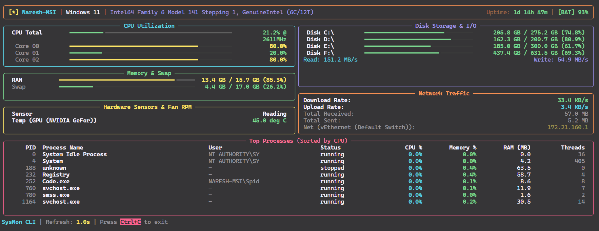
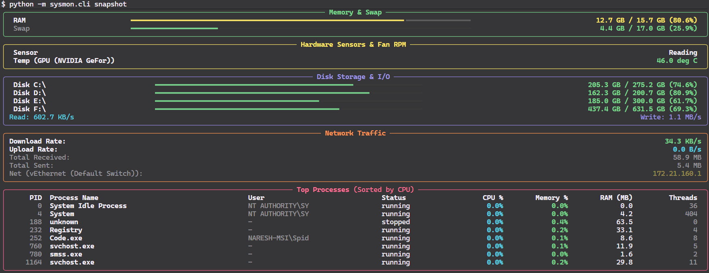
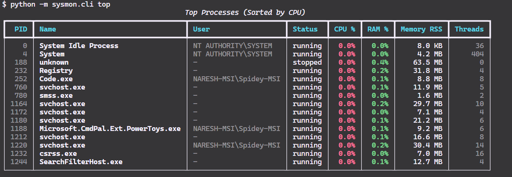

# ⚡ SysMon CLI

<div align="center">


**A fast, lightweight, and beautiful real-time system monitoring dashboard for your terminal.**

[Features](#-features) • [Screenshots](#-screenshots) • [Installation](#-installation) • [Usage](#-usage) • [Tech Stack](#-technologies-used)

</div>

---

## 📸 Screenshots

<div align="center">

### 1. Live Interactive Terminal Dashboard (TUI)


### 2. Snapshot & System Health Report


### 3. Top Process Snapshot


</div>

---

## ✨ Features

- 🖥️ **Live Interactive TUI**: Multi-panel live terminal dashboard with real-time updating progress bars.
- ⚡ **CPU Utilization**: Real-time overall CPU usage %, core-by-core meters, and clock frequency (MHz).
- 🧠 **Memory & Swap**: Visual RAM and Swap bars with exact used and available GB/MB stats.
- 🌡️ **Hardware Sensors & Fan RPM**: GPU temperature readings, ACPI thermal zones, and Fan RPM support.
- 💾 **Storage & Disk I/O**: Partition utilization with real-time disk read/write throughput (KB/s, MB/s).
- 🌐 **Network Throughput**: Live upload and download speeds, interface IP addresses, and total traffic counters.
- 📋 **Process Monitor**: Top running processes sorted by CPU or RAM consumption.
- 📸 **One-Click Export**: Save comprehensive system snapshots to **JSON** or **Markdown** reports.

---

## 📦 Installation

### 1. Clone the repository
```bash
git clone https://github.com/<your-username>/sysmon-cli.git
cd sysmon-cli
```

### 2. Install dependencies
```bash
pip install -r requirements.txt
```

### 3. (Optional) Install in editable mode
```bash
pip install -e .
```

---

## 🛠️ Usage & Commands

### Launch Live Interactive Dashboard
```bash
python -m sysmon.cli
```

### Subcommands & Options

| Command | Description |
|:---|:---|
| `python -m sysmon.cli` | Launch full interactive live dashboard |
| `python -m sysmon.cli snapshot` | Print a quick point-in-time system health summary |
| `python -m sysmon.cli top` | View top resource-consuming processes |
| `python -m sysmon.cli disk` | Show storage partition breakdown and disk I/O |
| `python -m sysmon.cli net` | Show network interfaces, IP addresses, and traffic |
| `python -m sysmon.cli sensors` | View hardware fan speeds and temperatures |
| `python -m sysmon.cli export --format json` | Save a snapshot to `sysmon_report.json` |
| `python -m sysmon.cli export --format md` | Save a snapshot to `sysmon_report.md` |

### Customizing Dashboard Parameters
```bash
# Refresh every 1.5 seconds, display top 10 processes, sorted by memory
python -m sysmon.cli dashboard --refresh 1.5 --limit 10 --sort-by memory
```

---

## 🧰 Technologies Used

- **Language:** [Python 3.9+](https://www.python.org/)
- **Terminal UI / Styling:** [Rich](https://github.com/Textualize/rich)
- **Metrics Collection:** [psutil](https://github.com/giampaolo/psutil)
- **CLI Framework:** [Typer](https://github.com/tiangolo/typer)
- **Testing:** [pytest](https://docs.pytest.org/)

---

## 🧪 Running Tests

Run the full automated test suite:

```bash
python -m pytest tests/
```

---

## 📜 License

Distributed under the **MIT License**. See [`LICENSE`](LICENSE) for more information.
